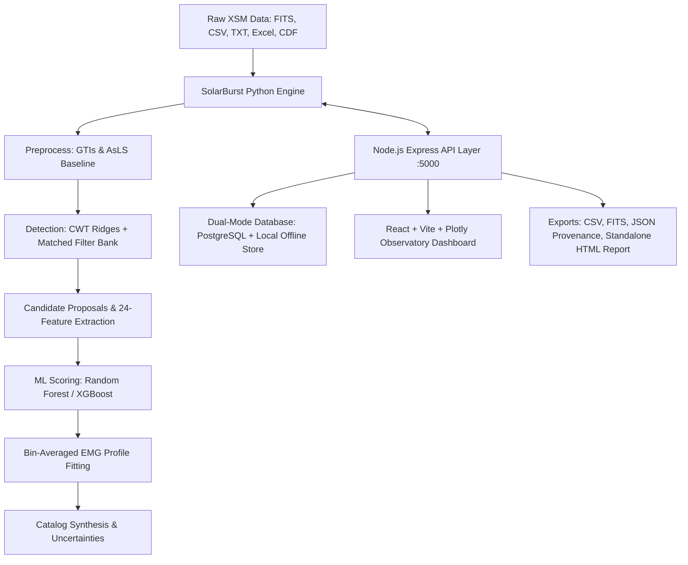

# SolarBurst — ISRO Chandrayaan-2 XSM Solar Burst Analysis Platform

[](https://python.org)
[](https://nodejs.org)
[](LICENSE)
[](tests/)

**SolarBurst** is a production-grade, authoritative scientific analysis platform designed for automated solar burst detection, physical profile decomposition, and catalog synthesis from Chandrayaan-2 Solar X-ray Monitor (XSM) observations.

Built for the **Inter IIT Tech Meet 10.0 — ISRO Problem Statement**, SolarBurst combines physics-based multi-scale signal processing with modern machine learning and an interactive, observatory-grade React dashboard.

---

## Key Scientific Highlights & Safeguards

1. **Physical Heating-Cooling Convolution Formulation:**
   - Bursts are parameterized using an Exponentially Modified Gaussian (EMG / `exponnorm`), modeling impulsive energy injection (Gaussian heating kernel $\sigma_h$) convolved with exponential thermal conduction and radiative plasma cooling ($\tau_c$).
   - Joint linear background estimation ($b_0 + b_1 t$) prevents baseline distortion.
   - Profile fitting uses analytic Jacobians with finite difference fallbacks via SciPy Levenberg-Marquardt / Truncated Newton (`least_squares`).
   - Finite integration bin-averaging ensures correct count conservation across abrupt boundaries.

2. **Standardized Strict Timing:**
   - Direct high-precision conversion between Chandrayaan-2 XSM MET (Mission Elapsed Time, epoch `2017-01-01 00:00:00 UTC`), ISO-8601 UTC, and Modified Julian Date (MJD).

3. **Noise-Correct Poisson Flare Injection:**
   - Synthetic flare injection benchmarks maintain Poisson statistics without double-counting noise: $C_{\text{injected}} \sim \text{Poisson}(C_{\text{real\_bkg}} + \lambda_{\text{flare}}(t))$.

4. **Rigorous Classification Safeguards:**
   - Raw XSM count rates ($\text{counts/s}$) are **never** assigned GOES flare class letters (A, B, C, M, X) without calibrated $0.1\text{--}0.8\,\text{nm}$ irradiance flux ($\text{W/m}^2$).
   - Bursts are classified by physical morphology (asymmetry ratio $\rho = t_{\text{rise}} / t_{\text{decay}}$), duration tiers, and uncalibrated count rate tiers.

5. **Multi-Scale Detection Engine:**
   - Asymmetric Least Squares (AsLS) iterative baseline estimation with event-masked background recalculation.
   - Mexican Hat / Ricker Continuous Wavelet Transform (CWT) ridge extraction across scales $1\text{s}$ to $1200\text{s}$.
   - Matched filter template bank spanning fast spikes, impulsive flares, and gradual events.
   - Dual-threshold hysteresis proposal growth and non-maximum suppression deduplication.

6. **Machine Learning Classifiers:**
   - 24 standardized physical and shape features per candidate.
   - Pre-trained **Random Forest Baseline** (`rf_baseline.joblib`) and **XGBoost Challenger** (`xgb_challenger.joblib`) with model cards and SHA256 integrity verification.

---

## Architecture Overview



---

## Quick Start

### Prerequisites
- **Python 3.10+** (Tested and compatible through Python 3.14)
- **Node.js 18+**
- (Optional) **Docker & Docker Compose**

### Option 1: One-Click Launch (Windows / Linux)
On Windows:
```cmd
launch.bat
```
On Linux / macOS:
```bash
chmod +x launch.sh
./launch.sh
```
This automatically verifies dependencies, installs the package, starts the backend on `http://127.0.0.1:5000`, and opens your browser.

---

### Option 2: Manual Start

1. **Install Python Package:**
   ```bash
   pip install -e .
   ```

2. **Start Backend (Serves API + Pre-built UI):**
   ```bash
   cd backend
   npm install
   node server.js
   ```
   Open **http://127.0.0.1:5000** in your browser.

3. **(Optional) Run Frontend in Vite Dev Mode:**
   ```bash
   cd frontend
   npm install
   npm run dev
   ```

---

### Option 3: Docker Deployment

Run the complete platform with PostgreSQL and containerized scientific engine:
```bash
docker-compose up --build
```
Access the application at `http://localhost:5000`.

---

## Python CLI Reference

SolarBurst includes a standalone command-line interface:

```bash
# Analyze an observation file with preset config and export catalog
solarburst analyze data/examples/synthetic_xsm_demo.fits --preset balanced --output results/catalog.csv

# Run synthetic demonstration pipeline
solarburst demo --output results/demo_summary.json

# Start the high-performance Python FastAPI microservice
solarburst serve --host 127.0.0.1 --port 8000
```

---

## Test Suite Verification

Run the full scientific test suite verifying I/O readers, preprocessing, baseline extraction, EMG fitting, and ML models:

```bash
pytest tests/ -v
```

All 10 core scientific unit and integration tests pass cleanly:
- `test_io.py`: Multi-format parsing (FITS, CSV, TSV, XLSX) and metadata extraction.
- `test_preprocess.py`: GTI segmentation, MAD noise estimation, Hampel screen, AsLS baseline.
- `test_fitting.py`: EMG forward model, bin-averaged convolution, non-linear least squares fit convergence.
- `test_ml.py`: 24-feature extractor, Random Forest and XGBoost model persistence and scoring.
- `test_end_to_end.py`: Synthetic observation generation, pipeline execution, and catalog validation.

---

## Web Dashboard Features (11 Dedicated Views)

1. **Dashboard (`/`):** Summary statistics, system health monitor, recent bursts, pipeline actions.
2. **Upload & Inspect (`/upload`):** Drag-and-drop file ingestion (FITS, CSV, XLSX, CDF), format auto-detection, HDU header inspection, time span summary.
3. **Light Curve Explorer (`/explorer`):** Interactive multi-resolution Plotly chart with raw counts, count rates, AsLS baseline, error bars, and burst highlight regions.
4. **Detection Controls (`/controls`):** Algorithmic presets (Balanced, Conservative, Sensitive), AsLS parameters ($\lambda, p$), ML acceptance thresholds, and re-run triggers.
5. **Burst Catalog (`/catalog`):** Filterable, sortable catalog table with search, complexity tags, reliability badges, and audit statuses.
6. **Event Detail (`/event/:id`):** Micro-inspection view featuring zoomed EMG fit curve, linear background, residual panel, full parameter table with bootstrap uncertainties, and human audit modal.
7. **Wavelet Analysis (`/wavelet`):** Continuous Wavelet Transform scalogram with Morlet/Mexican-Hat kernels and Cone of Influence (COI) masking.
8. **Model Training & Benchmarking (`/models`):** Synthetic flare injection bench, ROC-AUC evaluation, and model re-training.
9. **Distributions & Correlations (`/distributions`):** Scatter plots ($T_{\text{rise}}$ vs $T_{\text{decay}}$, Peak vs FWHM, Asymmetry vs Duration) and parameter histograms.
10. **Export & Reports (`/export`):** One-click downloads for CSV catalogs, FITS tables, JSON provenance manifests, and standalone offline HTML reports.
11. **Methods & Reference (`/methods`):** Comprehensive scientific documentation of all mathematical formulas, timing conventions, and classification rules.

---

## Directory Structure

```text
├── backend/                  # Node.js Express API & Offline Database Layer
│   ├── src/
│   │   ├── config.js         # Paths, ports, environment configuration
│   │   ├── db/               # PostgreSQL client & local JSON fallback store
│   │   ├── routes/           # REST endpoints (datasets, analysis, catalog, wavelet, export)
│   │   └── services/         # pythonBridge, jobQueue, reportGenerator
│   └── server.js             # API entrypoint & static frontend server
├── frontend/                 # React 18 + Vite Observatory Dashboard
│   ├── src/
│   │   ├── components/       # PlotlyChart, AuditModal, MetricCard, Navigation
│   │   ├── pages/            # 11 dedicated scientific views
│   │   ├── api.js            # Unified backend API client
│   │   └── index.css         # Deep navy observatory theme tokens
├── src/solarburst/           # Python Scientific Core Engine
│   ├── core/                 # Schemas, time_utils (MET/UTC), quality bitmasks
│   ├── io/                   # FITS, CSV, TSV, Excel, CDF readers & XSM adapter
│   ├── preprocess/           # GTIs, exposure-aware binning, AsLS baseline
│   ├── detection/            # CWT ridges, matched filter bank, hysteresis proposals
│   ├── ml/                   # 24-feature extractor, Random Forest, XGBoost
│   ├── fitting/              # Bin-averaged EMG convolution, multi-component BIC, uncertainty
│   ├── catalog/              # Classifications, parameter synthesis, exporters
│   ├── evaluation/           # Noise-correct Poisson injection, matching, metrics
│   ├── engine.py             # Master pipeline orchestrator
│   ├── cli.py                # Typer CLI application
│   └── service.py            # FastAPI microservice
├── models/pretrained/        # Serialized ML models (.joblib) & Model Cards (.json)
├── configs/                  # Preset YAML configurations (balanced, conservative, sensitive)
├── data/examples/            # Synthetic demonstration datasets (.fits, .csv)
├── tests/                    # pytest suite (10 test modules)
├── Dockerfile                # Production multi-stage container
├── docker-compose.yml        # Docker Compose with PostgreSQL
├── launch.bat                # Windows one-click launcher
├── launch.sh                 # Unix one-click launcher
└── pyproject.toml            # Build configuration & dependency definitions
```

---

## License
Distributed under the GNU General Public License v3.0 (GPL-3.0-or-later).
Designed for the Inter IIT Tech Meet 10.0 ISRO Problem Statement.
